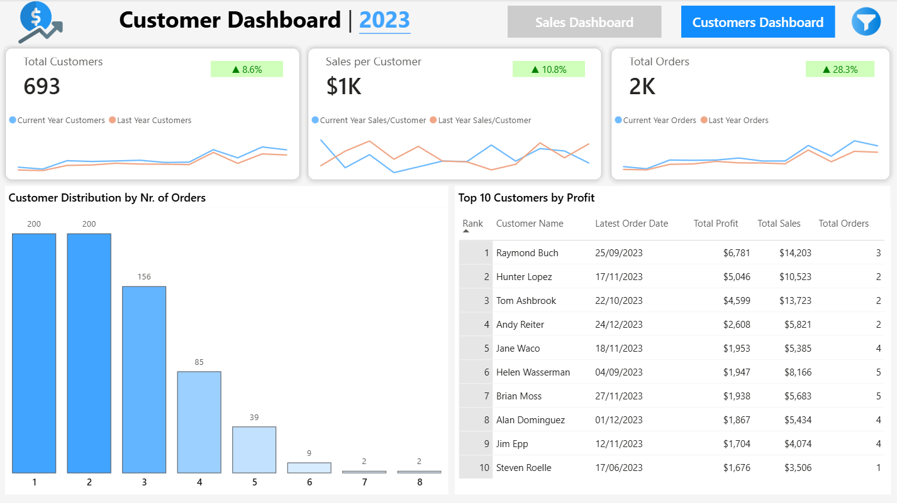

# 📊 Sales & Customer Dashboard Requirements

## 🖼️ Dashboard Preview

### Sales Dashboard

### Customer Dashboard

## 🌐 Language / Langue  
- English  
- Français  

---

🇬🇧 English Version

# 📈 Sales Dashboard

## 🎯 Dashboard Purpose

The purpose of the Sales Dashboard is to present an overview of sales metrics and trends in order to analyze year-over-year sales performance and understand sales trends.

---

## 📌 Key Requirements

### 📊 KPI Overview

Display a summary of:

- 💰 Total Sales
- 📈 Total Profit
- 📦 Total Quantity

For:

- 🗓️ Current Year
- 🕰️ Previous Year

---

### 📉 Sales Trends

- Present monthly data for each KPI for both:
  - 🟢 Current Year
  - 🔵 Previous Year

---

### 🏷️ Product Subcategory Comparison

- Compare sales performance across different product subcategories for:
  - 🟢 Current Year
  - 🔵 Previous Year

- Include comparison between:
  - 💰 Sales
  - 📈 Profit

---

### 📅 Weekly Trends for Sales & Profit

- Present weekly sales and profit data for the current year.

- Display:
  - 📊 Average weekly sales
  - 📊 Average weekly profit

---

# 👥 Customer Dashboard

## 🎯 Dashboard Purpose

The Customer Dashboard aims to provide an overview of customer data, trends, and behaviors.

It helps marketing teams and management:

- 🧠 Understand customer segments
- 😊 Improve customer satisfaction
- 🔁 Analyze customer engagement and loyalty

---

## 📌 Key Requirements

### 📊 KPI Overview

Display a summary of:

- 👤 Total Number of Customers
- 💰 Total Sales per Customer
- 🧾 Total Number of Orders

For:

- 🟢 Current Year
- 🔵 Previous Year

---

### 📉 Customer Trends

- Present monthly data for each KPI for both:
  - 🟢 Current Year
  - 🔵 Previous Year

---

### 📦 Customer Distribution by Number of Orders

Represent customer distribution based on the number of orders placed to provide insights into:

- 🧠 Customer behavior
- ❤️ Customer loyalty
- 🔁 Customer engagement

---

### 🏆 Top 10 Customers by Profit

Present the top 10 customers who generated the highest profits.

Include additional information such as:

- 🥇 Customer Rank
- 📦 Number of Orders
- 💰 Current Sales
- 📈 Current Profit
- 📅 Last Order Date

---

# ⚙️ Design & Interactivity Requirements

## 🔄 Dashboard Dynamic Features

The dashboards should:

- 📆 Allow users to view historical data by selecting any desired year.
- 🔀 Provide easy navigation between dashboards.
- 📊 Include interactive charts and graphs.
- 🖱️ Enable filtering directly through chart interactions.

---

## 🔎 Data Filters

Allow users to filter data using:

### 🏷️ Product Information

- Category
- Subcategory

### 📍 Location Information

- Region
- State
- City

---

🇫🇷 Version en français

# 📈 Tableau de Bord des Ventes

## 🎯 Objectif du Tableau de Bord

Le tableau de bord des ventes a pour objectif de présenter une vue d’ensemble des indicateurs de performance des ventes et des tendances afin d’analyser la performance des ventes d’une année sur l’autre et de comprendre les tendances de vente.

---

## 📌 Exigences Principales

### 📊 Vue d’ensemble des KPI

Afficher un résumé de :

- 💰 Ventes Totales
- 📈 Bénéfices Totaux
- 📦 Quantité Totale

Pour :

- 🗓️ Année en cours
- 🕰️ Année précédente

---

### 📉 Tendances des Ventes

- Présenter les données mensuelles pour chaque KPI pour :
  - 🟢 Année en cours
  - 🔵 Année précédente

---

### 🏷️ Comparaison des Sous-catégories de Produits

- Comparer les performances des ventes selon les différentes sous-catégories de produits pour :
  - 🟢 Année en cours
  - 🔵 Année précédente

- Inclure la comparaison entre :
  - 💰 Ventes
  - 📈 Bénéfices

---

### 📅 Tendances Hebdomadaires des Ventes et des Bénéfices

- Présenter les données hebdomadaires des ventes et des bénéfices pour l’année en cours.

- Afficher :
  - 📊 Moyenne hebdomadaire des ventes
  - 📊 Moyenne hebdomadaire des bénéfices

---

# 👥 Tableau de Bord Client

## 🎯 Objectif du Tableau de Bord

Le tableau de bord client vise à fournir une vue d’ensemble des données clients, des tendances et des comportements.

Il aide les équipes marketing et la direction à :

- 🧠 Comprendre les segments de clients
- 😊 Améliorer la satisfaction client
- 🔁 Analyser l’engagement et la fidélité des clients

---

## 📌 Exigences Principales

### 📊 Vue d’ensemble des KPI

Afficher un résumé de :

- 👤 Nombre total de clients
- 💰 Ventes par client
- 🧾 Nombre total de commandes

Pour :

- 🟢 Année en cours
- 🔵 Année précédente

---

### 📉 Tendances Clients

- Présenter les données mensuelles pour chaque KPI pour :
  - 🟢 Année en cours
  - 🔵 Année précédente

---

### 📦 Distribution des Clients par Nombre de Commandes

Représenter la distribution des clients selon le nombre de commandes passées afin d’obtenir des informations sur :

- 🧠 Comportement des clients
- ❤️ Fidélité des clients
- 🔁 Engagement des clients

---

### 🏆 Top 10 des Clients par Bénéfices

Présenter les 10 clients ayant généré le plus de bénéfices.

Inclure des informations supplémentaires telles que :

- 🥇 Classement du client
- 📦 Nombre de commandes
- 💰 Ventes actuelles
- 📈 Bénéfices actuels
- 📅 Date de la dernière commande

---

# ⚙️ Exigences de Design et d’Interactivité

## 🔄 Fonctionnalités Dynamiques du Tableau de Bord

Les tableaux de bord doivent :

- 📆 Permettre aux utilisateurs de consulter les données historiques en sélectionnant une année.
- 🔀 Faciliter la navigation entre les tableaux de bord.
- 📊 Inclure des graphiques interactifs.
- 🖱️ Permettre le filtrage directement via les graphiques.

---

## 🔎 Filtres de Données

Permettre aux utilisateurs de filtrer les données selon :

### 🏷️ Informations Produit

- Catégorie
- Sous-catégorie

### 📍 Informations de Localisation

- Région
- État / Province
- Ville

---

## 📌 Author
**BRAHIM BADREDDINE**
